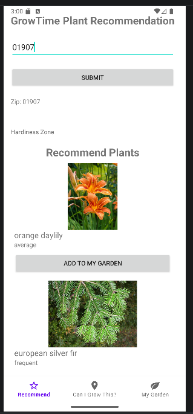
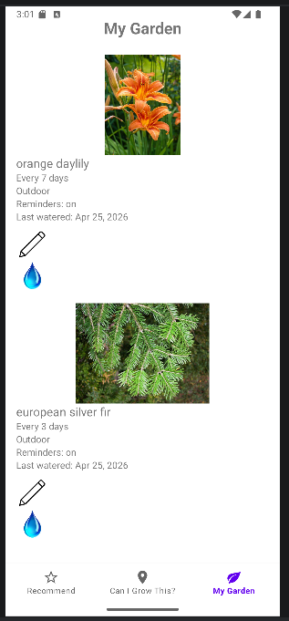
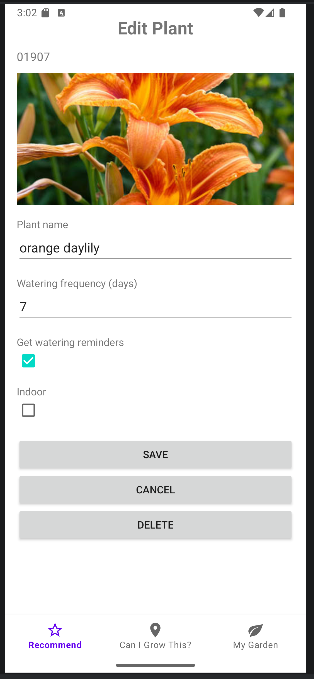
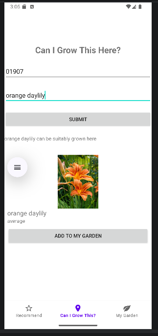
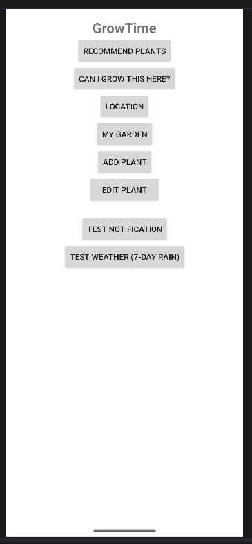
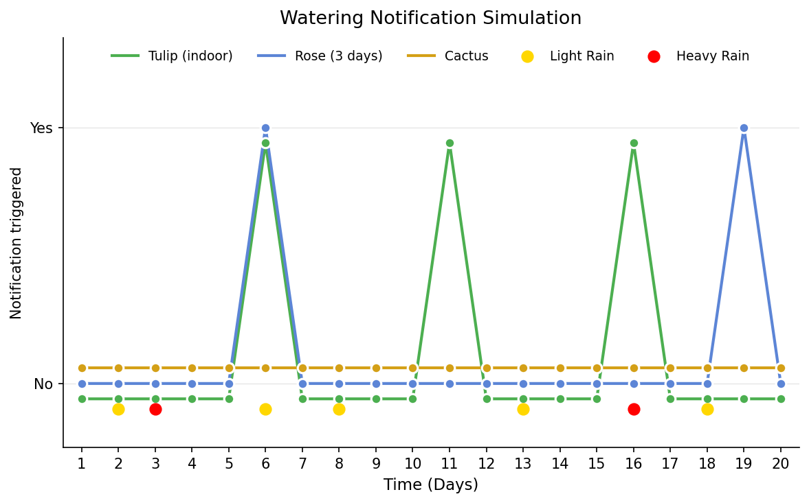

# 🌱 GrowTime


GrowTime is an **Android gardening assistant** that helps users successfully grow and maintain plants by providing **location-based plant recommendations** and **automated care reminders**.

The app reduces the frustration many beginner gardeners face by combining plant selection guidance with plant care management in one simple application.

---

# 📖 Table of Contents

* [Overview](#-overview)
* [Features](#-features)
* [GUI](#-gui)
* [Notification algorithm](notification-algorithm)
* [Architecture](#-architecture)
* [Tech Stack](#-tech-stack)
* [Installation](#-installation)
* [Continuous integration](#building-and-testing)
* [Usage](#-usage)
* [Evaluation](#-evaluation)
* [Future Improvements](#-future-improvements)
* [Team](#-team)

---

# 🌿 Overview

Gardening success depends on many variables including:

* Hardiness zones
* Watering schedules
* Weather

Most gardeners rely on scattered information from search engines, forums, and multiple apps. These sources often provide **generic advice** that does not account for a user’s specific region.

GrowTime solves this problem by combining:

* 🌎 **Location-based plant recommendations**
* ⏰ **Automated care reminders**
* 🌧 **Weather-aware watering notifications**

This allows users to choose appropriate plants and maintain them successfully.

---

# ✨ Features

### 🌍 Location-Based Plant Recommendations

Uses a user's **zip code** to recommend plants that grow well in their local soil.

### 🌱 Plant Collection Management

Users can create a personal list of plants they are growing and track their care.

### ⏰ Care Reminders

GrowTime generates reminders for:

* Watering

### 🌧 Weather-Aware Notifications

The app integrates with a **weather API** to adjust watering reminders based on rainfall.

### 📱 Simple Mobile Interface

The application includes multiple screens:

* Home Screen
* Plant recommendation screen
* Reminder screen

---

# 📸 GUI







---
# Notification algorithm
When a plant is indoors, a reminder to water it comes every few days, where the exact number of days depend on the watering frequency of the plant. If it is outdoors, then the plant will consider itself watered if the forcast for then next 7 days contains over 10 mm of rain. If a plant has an option set to not get watering reminders, it will not generate any reminders.


This figure was produced by running GrowTime with a special testing configuration. Specific instructions to generate it can be found in graphGen/instructions.txt. 

The simulation demonstrates the way our algorithm decides to send notifications based on the time when it rains. The cactus had an option set to not get watering reminders so no reminders were triggered for it. The tulip was marked as indoors, so it recieved a watering reminder every 5 days, regardless of when it rained. The rose was set to recieve a notification every 3 days but it was outside. It needed to be watered on day 6 because it was 3 days after a strong rain. The forcast for the next 7 days showed some rain, but the rainfall totalled to under 10 mm - the rain on day 6 is 3mm and the other yellow dots are about 6 mm. On day 8, it considered itself watered because there were 2 moderate rains in the next 7 days which totaled 10 mm. Between days 10 and 16, the plant considered itself watered because it saw that a strong rain was coming. Finally, it needed to be watered on day 19 because it was 3 days after the strong rain and there was not much rain upcoming.


---

# 🏗 Architecture

GrowTime follows a **modular mobile application architecture**.

```
User
  │
  ▼
Android UI Layer
(Activity / Fragment Screens)
  │
  ▼
Application Logic
(Recommendation Engine + Reminder System)
  │
  ├── Plant Database (JSON)
  ├── Weather API Service
  └── Notification Scheduler
```

### Components

**UI Layer**
Handles user input and screen navigation.

**Recommendation Engine**
Determines which plants are suitable for the user’s region.

**Plant Database**
JSON dataset containing plant information and hardiness zone compatibility.

**Weather API Service**
Retrieves rainfall and weather information.

**Reminder System**
Generates notifications for watering and other plant care tasks.

---

# 🧰 Tech Stack

| Technology            | Purpose                               |
| --------------------- | ------------------------------------- |
| Java                  | Core application programming language |
| Android Studio        | Development environment               |
| Android Navigation UI | Screen navigation                     |
| JSON                  | Plant dataset storage                 |
| Weather API           | Rainfall and weather information      |
| Android Notifications | Care reminder alerts                  |

---

# ⚙ Installation

### Prerequisites

* Android Studio
* Android SDK
* Java 8+

Steps for installing android studio:
If you do not have Jet Brains Tool Box installed yet, install it with steps 1-3
1) Navigate to https://www.jetbrains.com/toolbox-app/
2) Click the drop down on the ".exe" next to the purple download button and select the option 
that corresponds to your machine. e.g. ".exe (Windows)" for a Windows machine.
3) Click download
4) Once it is installed, open the downloaded file. 
5) Click next/ok if it asks for something during setup. 
6) Search for android studio under tools and install it.
7) Click next/ok if it asks for something during setup.

### Clone the Repository

```bash
git clone https://github.com/chesseraf/GrowTime
```

### Run the Application

1. Open the project in **Android Studio**
2. On the top right, there is a side bar with 5 options. Open the device manager (3rd one)
3. Click "Add a new device..." -> "Create a virtual device" -> "medium phone" -> "finish"
4. This will take a bit to install this phone. Once installed, click run next to this medium phone in the device manager
5. Click "run app" which is a triangle in the top of the screen
6. The phone should launch the app on the right side of the screen
### What to do if it did not launch
Below are some problems that have been encountered and what was done to solve them.
1. If it says that gradle needs to sync in the top of the screen, let it sync
2. If the option to run does not appear, it may need to be built. Click the hammer which is the 6th from the bottom in the tool bar on the bottom left corner. Then click the hammer next to it to build. After building, try launching again.
3. If it complains about the version of the gradle being out of date then Android Studio may need to be updated. To update it, go to the Jet Brains Toolbox and update Android Studio to the latest version.

---

# Building and testing
To run automated tests and build, run the following command:
```
./gradlew connectedAndroidTest
```
If the build fails, it will show which tests failed. While it is running, you can see what some of the tests are doing on the device shown on the right side of the screen.

To just build after making some changes, run:
```
./gradlew build
```
To have the program launched in the emulator, the play button still needs to be clicked in the GUI of Android Studio because the emulator runs inside of it.

# Coding tests
The code for the tests is in the folder "app\src\androidTest\java\com\example\growtime"

# 🚀 Usage

1. Launch GrowTime.
2. Enter your **zip code**.
3. Browse recommended plants suitable for your region.
4. Add plants to your **plant collection**.
5. Receive reminders when plants need watering.

---

# 📊 Evaluation

GrowTime was evaluated using **automated UI and integration tests** built with Android’s Espresso testing framework. These tests simulate real user interactions and verify that core features of the application behave correctly.

### 🧪 Testing Approach

Our testing focuses on validating three main areas:

1. **Navigation and Screen Transitions**
2. **User Input and Interaction**
3. **Data Flow and Application State**

### 🔁 Navigation & UI Flow Testing

We tested that all major navigation paths correctly open their intended screens. These include:

* Recommendation screen
* Add Plant screen
* Edit Plant screen
* My Garden screen
* Location screen

Each test simulates a button press and verifies that the correct activity is launched. This ensures that users can reliably move through the app without broken links or navigation errors.

### ⌨️ User Input Validation

We verified that user inputs are properly handled and reflected in the UI:

* Entering a ZIP code correctly updates the displayed location
* Typing a plant name correctly updates the input field
* Submission buttons are visible and functional

These tests ensure that the app responds accurately to user input and maintains a consistent interface.

### 🌱 Functional Feature Testing

Core features of the application were tested through realistic workflows:

* A user can enter a ZIP code and receive plant recommendations
* A recommended plant can be added to the “My Garden” collection
* The plant appears correctly in the user’s saved plant list

This confirms that the full recommendation → selection → storage pipeline works as intended.

### 📦 Data & State Validation

We tested how the application handles data storage and state:

* The “My Garden” view correctly starts empty for new users
* An empty state message is displayed when no plants are added
* After adding a plant, the collection updates dynamically

These tests ensure that the app maintains accurate state across user interactions.

### ⚠️ Limitations of Testing

* Some tests rely on timed delays (`Thread.sleep`) to wait for UI updates, which may not be fully reliable
* External dependencies (such as APIs) are not fully mocked, so behavior may vary with network conditions
* Testing is focused on UI and integration behavior rather than unit-level logic

---

# 🔮 Future Improvements

Potential future improvements include:

* 🌎 Global plant support
* 🌱 Expanded plant database
* ☁ Cloud syncing across devices

---

# 👥 Team

GrowTime was developed as part of a **Software Engineering course project**.

Team Members:

* **Gia Panchal**
* **Max Fitzgerald**
* **Christopher Nguyen**
* **Rafael Pashkov**
* **Natalie Resendes**

---

⭐ If you like this project, consider giving it a star!

---
